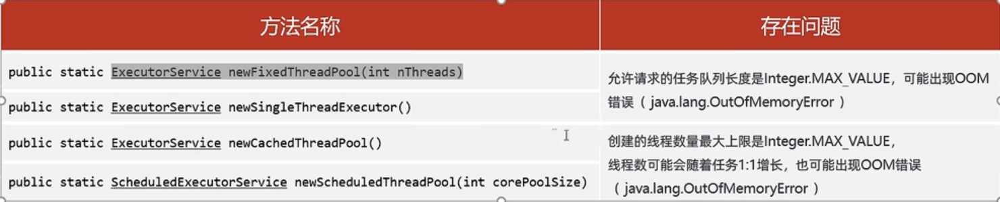

## 线程池的创建及核心参数

**Executors创建线程池**

 Java中创建线程池很简单，只需要调用`Executors`中相应的便捷方法即可，比如`Executors.newFixedThreadPool(int nThreads)`，但是便捷不仅隐藏了复杂性，也为我们埋下了潜在的隐患（OOM，线程耗尽）。

`Executors`创建线程池方法：

| 方法名                             | 功能                                                       |
| :--------------------------------- | :--------------------------------------------------------- |
| `newFixedThreadPool(int nThreads)` | 创建固定大小的线程池                                       |
| `newSingleThreadExecutor()`        | 创建只有一个线程的线程池                                   |
| `newCachedThreadPool()`            | 创建一个不限线程数上限的线程池，任何提交的任务都将立即执行 |

创建线程池应该直接使用`ThreadPoolExecutor`的构造方法。没错，上述`Executors`方法创建的线程池就是`ThreadPoolExecutor`。

**Executors可能存在的陷阱**

* 大型并发系统环境中使用Executors可能出现系统风险



**ThreadPoolExecutor构造方法**

`Executors`中创建线程池的快捷方法，实际上是调用了`ThreadPoolExecutor`的构造方法（定时任务使用的是`ScheduledThreadPoolExecutor`），该类构造方法参数列表如下：

```java
// Java线程池的完整构造函数
public ThreadPoolExecutor(
  int corePoolSize, // 线程池长期维持的线程数，即使线程处于Idle状态，也不会回收。
  int maximumPoolSize, // 线程数的上限
  long keepAliveTime, TimeUnit unit, // 超过corePoolSize的线程的idle时长，
                                     // 超过这个时间，多余的线程会被回收。
  BlockingQueue<Runnable> workQueue, // 任务的排队队列
  ThreadFactory threadFactory, // 新线程的产生方式
  RejectedExecutionHandler handler) // 拒绝策略
```

有7个参数，这些参数中，比较容易引起问题的有`corePoolSize`, `maximumPoolSize`, `workQueue`以及`handler`：

- `corePoolSize`和`maximumPoolSize`设置不当会影响效率，甚至耗尽线程；
- `workQueue`设置不当容易导致OOM；
- `handler`设置不当会导致提交任务时抛出异常。

 **ThreadPoolExecutor中参数详解**

> **corePoolSize**：核心线程数，也是线程池中常驻的线程数，线程池初始化时默认是没有线程的，当任务来临时才开始创建线程去执行任务
>
> **maximumPoolSize**：最大线程数，在核心线程数的基础上可能会额外增加一些非核心线程，需要注意的是只有当workQueue队列填满时才会创建多于corePoolSize的线程(线程池总线程数不超过maxPoolSize)
>
> **keepAliveTime**：非核心线程的空闲时间超过keepAliveTime就会被自动终止回收掉，注意当corePoolSize=maxPoolSize时，keepAliveTime参数也就不起作用了(因为不存在非核心线程)；
>
> **unit**：keepAliveTime的时间单位
>
> **workQueue**：用于保存任务的队列，可以为无界、有界、同步移交三种队列类型之一，当池子里的工作线程数大于corePoolSize时，这时新进来的任务会被放到队列中
>
> **threadFactory**：创建线程的工厂类，默认使用Executors.defaultThreadFactory()，也可以使用guava库的ThreadFactoryBuilder来创建
>
> **handler**：线程池无法继续接收任务(队列已满且线程数达到maximunPoolSize)时的饱和策略，取值有AbortPolicy、CallerRunsPolicy、DiscardOldestPolicy、DiscardPolicy


**线程池中的线程创建流程图：**


举个栗子：现有一个线程池，corePoolSize=10，maxPoolSize=20，队列长度为100，那么当任务过来会先创建10个核心线程数，接下来进来的任务会进入到队列中直到队列满了，会创建额外的线程来执行任务(最多20个线程)，这个时候如果再来任务就会执行拒绝策略

**workQueue队列**

SynchronousQueue(同步移交队列)：队列不作为任务的缓冲方式，可以简单理解为队列长度为零

LinkedBlockingQueue(无界队列)：队列长度不受限制，当请求越来越多时(任务处理速度跟不上任务提交速度造成请求堆积)可能导致内存占用过多或OOM

ArrayBlockintQueue(有界队列)：队列长度受限，当队列满了就需要创建多余的线程来执行任务

 **handler拒绝策略**

- AbortPolicy：丢弃任务并抛出RejectedExecutionException异常。是默认的策略
- DiscardPolicy：丢弃任务，但是不抛出异常这是不推荐的做法
- DiscardOldestPolicy：抛弃队列中等待最久的任务然后把当前任务加入队列中
- CallerRunsPolicy：让提交任务的线程去执行任务，由主线程负责调用任务的run()方法从而绕过线程池直接执行

## 常见的几种创建线程池方式

**newFixedThreadPool：**

使用的构造方式为

`new ThreadPoolExecutor(var0, var0, 0L, TimeUnit.MILLISECONDS, new LinkedBlockingQueue())`，

设置了corePoolSize=maxPoolSize，keepAliveTime=0(此时该参数没作用)，无界队列，任务可以无限放入，当请求过多时(任务处理速度跟不上任务提交速度造成请求堆积)可能导致占用过多内存或直接导致OOM异常


**newSingleThreadExector：**

使用的构造方式为

`new ThreadPoolExecutor(1, 1, 0L, TimeUnit.MILLISECONDS, new LinkedBlockingQueue(), var0)`，

基本同newFixedThreadPool，但是将线程数设置为了1，单线程，弊端和newFixedThreadPool一致


**newCachedThreadPool：**

使用的构造方式为

`new ThreadPoolExecutor(0, 2147483647, 60L, TimeUnit.SECONDS, new SynchronousQueue())`，

corePoolSize=0，maxPoolSize为很大的数，同步移交队列，也就是说不维护常驻线程(核心线程)，每次来请求直接创建新线程来处理任务，也不使用队列缓冲，会自动回收多余线程，由于将maxPoolSize设置成Integer.MAX_VALUE，当请求很多时就可能创建过多的线程，导致资源耗尽OOM

**newScheduledThreadPool：**

使用的构造方式为：

`new ThreadPoolExecutor(var1, 2147483647, 0L, TimeUnit.NANOSECONDS, new ScheduledThreadPoolExecutor.DelayedWorkQueue())`，

支持定时周期性执行，注意一下使用的是延迟队列，弊端同newCachedThreadPool一致

所以根据上面分析我们可以看到，FixedThreadPool和SigleThreadExecutor中之所以用LinkedBlockingQueue无界队列，是因为设置了corePoolSize=maxPoolSize，线程数无法动态扩展，于是就设置了无界阻塞队列来应对不可知的任务量；而CachedThreadPool则使用的是SynchronousQueue同步移交队列，为什么使用这个队列呢？因为CachedThreadPool设置了corePoolSize=0，maxPoolSize=Integer.MAX_VALUE，来一个任务就创建一个线程来执行任务，用不到队列来存储任务；SchduledThreadPool用的是延迟队列DelayedWorkQueue。在实际项目开发中也是推荐使用手动创建线程池的方式，而不用默认方式，关于这点在《阿里巴巴开发规范》中是这样描述的：


**关闭线程池**

* shutdownNow()：立即关闭线程池(暴力)，正在执行中的及队列中的任务会被中断，同时该方法会返回被中断的队列中的任务列表
* shutdown()：平滑关闭线程池，正在执行中的及队列中的任务能执行完成，后续进来的任务会被执行拒绝策略
* isTerminated()：当正在执行的任务及对列中的任务全部都执行（清空）完就会返回true

## 手动创建线程池(推荐)

上面说了使用Executors工具类创建的线程池有隐患，那如何使用才能避免这个隐患呢？建立自己的线程工厂类，灵活设置关键参数：

```java
//这里默认拒绝策略为AbortPolicy
private static ExecutorService executor = new ThreadPoolExecutor(10,10,60L, TimeUnit.SECONDS,new ArrayBlockingQueue(10));
```

使用guava包中的ThreadFactoryBuilder工厂类来构造线程池:

```java
private static ThreadFactory threadFactory = new ThreadFactoryBuilder().build();
 
private static ExecutorService executorService = new ThreadPoolExecutor(10, 10, 60L, TimeUnit.SECONDS, new ArrayBlockingQueue<Runnable>(10), threadFactory, new ThreadPoolExecutor.AbortPolicy());
```

通过guava的ThreadFactory工厂类还可以指定线程组名称，这对于后期定位错误时也是很有帮助的

```java
ThreadFactory threadFactory = new ThreadFactoryBuilder().setNameFormat("thread-pool-d%").build();
```

##  Callable和Runnable

可以向线程池提交的任务有两种：`Runnable`和`Callable`，二者的区别如下：

1. 方法签名不同，`void Runnable.run()`, `V Callable.call() throws Exception`
2. 是否允许有返回值，`Callable`允许有返回值
3. 是否允许抛出异常，`Callable`允许抛出异常。

`Callable`是JDK1.5时加入的接口，作为`Runnable`的一种补充，允许有返回值，允许抛出异常。

### 三种提交任务的方式：

| 提交方式                             | 说明                                                         |
| :----------------------------------- | :----------------------------------------------------------- |
| `Future<T> submit(Callable<T> task)` | 执行任务，返回未来任务对象获取线程结果，一般拿来执行callable 任务 |
| `void execute(Runnable command)`     | 执行任务/命令，没有返回值,一般用来执行Runnable 任务          |
| `Future<?> submit(Runnable task)`    | 无返回值，虽然返回Future，但是其get()方法总是返回null        |

| 关闭方法                        | 说明                                                   |
| ------------------------------- | ------------------------------------------------------ |
| `void shutdown()`               | 等任务执行完毕后关闭线程池                             |
| `List<Runnacble> shutdownNow()` | 立刻关闭，停止正在执行的任务，并返回队列中未执行的任务 |

```java
@FunctionalInterface
public interface Runnable {
    public abstract void run();
}
 
@FunctionalInterface
public interface Callable<V> {
    V call() throws Exception;
}
```

### Future和FutureTask

Future接口用来表示执行异步任务的结果存储器，当一个任务的执行时间过长就可以采用这种方式：把任务提交给子线程去处理，主线程不用同步等待，当向线程池提交了一个Callable或Runnable任务时就会返回Future，用Future可以获取任务执行的返回结果。Future的主要方法包括：

get()方法：返回任务的执行结果，若任务还未执行完，则会一直阻塞直到完成为止，如果执行过程中发生异常，则抛出异常，但是主线程是感知不到并且不受影响的，除非调用get()方法进行获取结果则会抛出ExecutionException异常；
get(long timeout, TimeUnit unit)：在指定时间内返回任务的执行结果，超时未返回会抛出TimeoutException，这个时候需要显式的取消任务；
cancel(boolean mayInterruptIfRunning)：取消任务，boolean类型入参表示如果任务正在运行中是否强制中断；
isDone()：判断任务是否执行完毕，执行完毕不代表任务一定成功执行，比如任务执行失但也执行完毕、任务被中断了也执行完毕都会返回true，它仅仅表示一种状态说后面任务不会再执行了；
isCancelled()：判断任务是否被取消；
下面来实际演示Future和FutureTask的用法：

```java
public static void main(String[] args) throws ExecutionException, InterruptedException {
    ExecutorService executorService = Executors.newFixedThreadPool(10);
    Future<Integer> future = executorService.submit(new Task());
    Integer integer = future.get();
    System.out.println(integer);
    executorService.shutdown();
}

static class Task implements Callable<Integer> {
    @Override
    public Integer call() throws Exception {
        System.out.println("子线程开始计算");
        int sum = 0;
        for (int i = 0; i <= 100; i++) {
            sum += i;
        }
        return sum;
    }
}
```

```java
public static void main(String[] args) throws ExecutionException, InterruptedException {
    ExecutorService executorService = Executors.newFixedThreadPool(10);
    FutureTask<Integer> futureTask = new FutureTask<>(new Task());
    executorService.submit(futureTask);
    Integer integer = futureTask.get();
    System.out.println(integer);
    executorService.shutdown();
}

static class Task implements Callable<Integer> {
    @Override
    public Integer call() throws Exception {
        System.out.println("子线程开始计算");
        int sum = 0;
        for (int i = 0; i <= 100; i++) {
            sum += i;
        }
        return sum;
    }
}
```

## 线程池的优化

当前在JDK中默认使用的线程池 ThreadPoolExecutor，在具体使用场景中，有以下几个缺点

1. core线程一般不会timeOut
2. 新任务提交时，如果工作线程数小于 coreSize，会自动先创建线程，即使当前工作线程已经空闲，这样会造成空闲线程浪费
3. 设置的maxSize参数只有在队列满之后，才会生效，而默认情况下容器队列会很大(比如1000)

如果一个coreSize为10，maxSize为100,队列长度为1000的线程池，在运行一段时间之后的效果会是以下2个效果:

1. 系统空闲时，线程池中始终保持10个线程不变，有一部分线程在执行任务，另一部分线程一直wait中(即使设置allowCoreThreadTimeOut)
2. 系统繁忙时，线程池中线程仍然为10个，但队列中有还没有执行的任务(不超过1000),存在任务堆积现象

本文将描述一下简单版本的线程池，参考于 Tomcat ThreadPoolExecutor, 实现以下3个目标

1. 新任务提交时，如果有空闲线程，直接让空闲线程执行任务，而非创建新线程
2. 如果coreSize满了，并且线程数没有超过maxSize，则优先创建线程，而不是放入队列
3. 其它规则与ThreadPoolExecutor一致，如 timeOut机制

首先看一下ThreadPoolExecutor的执行逻辑, 其基本逻辑如下

1. 如果线程数小于coreSize，直接创建新线程并执行(coreSize逻辑)
2. 尝试放入队列
3. 放入队列失败，则尝试创建新线程(maxSize逻辑)

而执行线程的任务执行逻辑，就是不断地从队列里面获取任务并执行，换言之，即如果有执行线程，直接往队列里面放任务，执行线程就会被通知到并直接执行任务.

**空闲线程优先**

空闲线程优先在基本逻辑中，即如果线程数小于coreSize，但如果有空闲线程，就取消创建线程的逻辑. 在有空闲线程的情况下，直接将任务放入队列中，即达到任务执行的目的。

这里的逻辑即是直接调整默认的ThreadPoolExecutor逻辑，通过重载 execute(Runnable) 方法达到效果. 具体代码如下所示:

```java
public void execute(Runnable command) {
 
    //此处优先处理有活跃线程的情况，避免在<coreSize时，直接创建线程
 
    if(getActiveCount() < getPoolSize()) {
        if(pool1.offer(command)) {
            return;
        }
    }
    super.execute(command);
}
```

**coreSize满了优先创建线程**

从之前的逻辑来看，如果放入队列失败，则尝试创建新线程。在这个时候，相应的coreSize肯定已经满了。那么，只需要处理一下逻辑，将其offer调整为false，即可以实现相应的目的。

这里的逻辑，即是重新定义一个BlockingDeque，重载相应的offer方法，相应的参考如下:

```java
public boolean offer(Runnable o) {
 
    //这里的parent为ThreadPoolExecutor的引用
    int poolSize = parent.getPoolSize();
    int maxPoolSize = parent.getMaximumPoolSize();
 
    //还没到最大值,先创建线程
    if(poolSize < maxPoolSize) {
        return false;
    }
    //默认逻辑
    return super.offer(o);
}
```

## Springboot中使用线程池

```java
/**
 * @ClassName ThreadPoolConfig
 * @Description 配置类中构建线程池实例，方便调用
 */
@Configuration
public class ThreadPoolConfig {
    @Bean(value = "threadPoolInstance")
    public ExecutorService createThreadPoolInstance() {
        //通过guava类库的ThreadFactoryBuilder来实现线程工厂类并设置线程名称
        ThreadFactory threadFactory = new ThreadFactoryBuilder().setNameFormat("thread-pool-%d").build();
        ExecutorService threadPool = new ThreadPoolExecutor(10, 16, 60L, TimeUnit.SECONDS, new ArrayBlockingQueue<Runnable>(100), threadFactory, new ThreadPoolExecutor.AbortPolicy());
        return threadPool;
    }
}
```

```java
//通过name=threadPoolInstance引用线程池实例
@Resource(name = "threadPoolInstance")
private ExecutorService executorService;

@Override
public void spikeConsumer() {
    //TODO
    executorService.execute(new Runnable() {
        @Override
        public void run() {
            //TODO
            //执行业务逻辑
        }});
}
```

**其它相关**

在ThreadPoolExecutor类中有两个比较重要的方法引起了我们的注意：beforeExecute和afterExecute

```java
 protected void beforeExecute(Thread var1, Runnable var2) {
 }
 
 protected void afterExecute(Runnable var1, Throwable var2) {
 }
```

