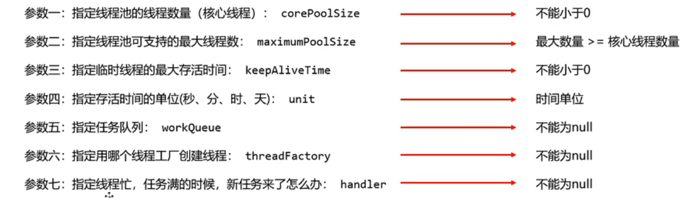
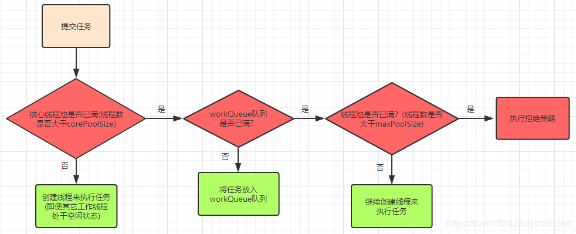
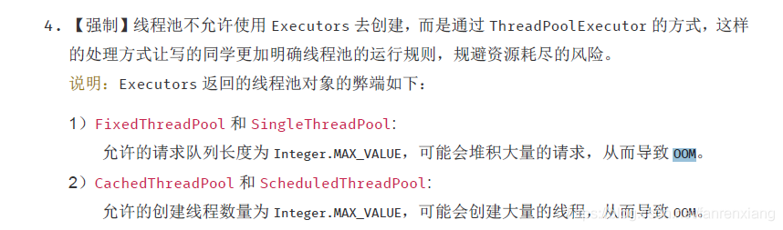

## 线程池的创建及核心参数

**Executors创建线程池**

 Java中创建线程池很简单，只需要调用`Executors`中相应的便捷方法即可，比如`Executors.newFixedThreadPool(int nThreads)`，但是便捷不仅隐藏了复杂性，也为我们埋下了潜在的隐患（OOM，线程耗尽）。

`Executors`创建线程池方法：

| 方法名                             | 功能                                                       |
| :--------------------------------- | :--------------------------------------------------------- |
| `newFixedThreadPool(int nThreads)` | 创建固定大小的线程池                                       |
| `newSingleThreadExecutor()`        | 创建只有一个线程的线程池                                   |
| `newCachedThreadPool()`            | 创建一个不限线程数上限的线程池，任何提交的任务都将立即执行 |

创建线程池应该直接使用`ThreadPoolExecutor`的构造方法。没错，上述`Executors`方法创建的线程池就是`ThreadPoolExecutor`。

**ThreadPoolExecutor构造方法**

`Executors`中创建线程池的快捷方法，实际上是调用了`ThreadPoolExecutor`的构造方法（定时任务使用的是`ScheduledThreadPoolExecutor`），该类构造方法参数列表如下：

```java
// Java线程池的完整构造函数
public ThreadPoolExecutor(
  int corePoolSize, // 线程池长期维持的线程数，即使线程处于Idle状态，也不会回收。
  int maximumPoolSize, // 线程数的上限
  long keepAliveTime, TimeUnit unit, // 超过corePoolSize的线程的idle时长，
                                     // 超过这个时间，多余的线程会被回收。
  BlockingQueue<Runnable> workQueue, // 任务的排队队列
  ThreadFactory threadFactory, // 新线程的产生方式
  RejectedExecutionHandler handler) // 拒绝策略
```

有7个参数，这些参数中，比较容易引起问题的有`corePoolSize`, `maximumPoolSize`, `workQueue`以及`handler`：

- `corePoolSize`和`maximumPoolSize`设置不当会影响效率，甚至耗尽线程；
- `workQueue`设置不当容易导致OOM；
- `handler`设置不当会导致提交任务时抛出异常。

 **ThreadPoolExecutor中参数详解**

> **corePoolSize**：核心线程数，也是线程池中常驻的线程数，线程池初始化时默认是没有线程的，当任务来临时才开始创建线程去执行任务
>
> **maximumPoolSize**：最大线程数，在核心线程数的基础上可能会额外增加一些非核心线程，需要注意的是只有当workQueue队列填满时才会创建多于corePoolSize的线程(线程池总线程数不超过maxPoolSize)
>
> **keepAliveTime**：非核心线程的空闲时间超过keepAliveTime就会被自动终止回收掉，注意当corePoolSize=maxPoolSize时，keepAliveTime参数也就不起作用了(因为不存在非核心线程)；
>
> **unit**：keepAliveTime的时间单位
>
> **workQueue**：用于保存任务的队列，可以为无界、有界、同步移交三种队列类型之一，当池子里的工作线程数大于corePoolSize时，这时新进来的任务会被放到队列中
>
> **threadFactory**：创建线程的工厂类，默认使用Executors.defaultThreadFactory()，也可以使用guava库的ThreadFactoryBuilder来创建
>
> **handler**：线程池无法继续接收任务(队列已满且线程数达到maximunPoolSize)时的饱和策略，取值有AbortPolicy、CallerRunsPolicy、DiscardOldestPolicy、DiscardPolicy



**线程池中的线程创建流程图：**



举个栗子：现有一个线程池，corePoolSize=10，maxPoolSize=20，队列长度为100，那么当任务过来会先创建10个核心线程数，接下来进来的任务会进入到队列中直到队列满了，会创建额外的线程来执行任务(最多20个线程)，这个时候如果再来任务就会执行拒绝策略

**workQueue队列**

SynchronousQueue(同步移交队列)：队列不作为任务的缓冲方式，可以简单理解为队列长度为零

LinkedBlockingQueue(无界队列)：队列长度不受限制，当请求越来越多时(任务处理速度跟不上任务提交速度造成请求堆积)可能导致内存占用过多或OOM

ArrayBlockintQueue(有界队列)：队列长度受限，当队列满了就需要创建多余的线程来执行任务

 **handler拒绝策略**

- AbortPolicy：中断抛出异常
- DiscardPolicy：默默丢弃任务，不进行任何通知
- DiscardOldestPolicy：丢弃掉在队列中存在时间最久的任务
- CallerRunsPolicy：让提交任务的线程去执行任务(对比前三种比较友好一丢丢)

## 常见的几种创建线程池方式

**newFixedThreadPool：**

使用的构造方式为

`new ThreadPoolExecutor(var0, var0, 0L, TimeUnit.MILLISECONDS, new LinkedBlockingQueue())`，

设置了corePoolSize=maxPoolSize，keepAliveTime=0(此时该参数没作用)，无界队列，任务可以无限放入，当请求过多时(任务处理速度跟不上任务提交速度造成请求堆积)可能导致占用过多内存或直接导致OOM异常


**newSingleThreadExector：**

使用的构造方式为

`new ThreadPoolExecutor(1, 1, 0L, TimeUnit.MILLISECONDS, new LinkedBlockingQueue(), var0)`，

基本同newFixedThreadPool，但是将线程数设置为了1，单线程，弊端和newFixedThreadPool一致


**newCachedThreadPool：**

使用的构造方式为

`new ThreadPoolExecutor(0, 2147483647, 60L, TimeUnit.SECONDS, new SynchronousQueue())`，

corePoolSize=0，maxPoolSize为很大的数，同步移交队列，也就是说不维护常驻线程(核心线程)，每次来请求直接创建新线程来处理任务，也不使用队列缓冲，会自动回收多余线程，由于将maxPoolSize设置成Integer.MAX_VALUE，当请求很多时就可能创建过多的线程，导致资源耗尽OOM

**newScheduledThreadPool：**

使用的构造方式为：

`new ThreadPoolExecutor(var1, 2147483647, 0L, TimeUnit.NANOSECONDS, new ScheduledThreadPoolExecutor.DelayedWorkQueue())`，

支持定时周期性执行，注意一下使用的是延迟队列，弊端同newCachedThreadPool一致

所以根据上面分析我们可以看到，FixedThreadPool和SigleThreadExecutor中之所以用LinkedBlockingQueue无界队列，是因为设置了corePoolSize=maxPoolSize，线程数无法动态扩展，于是就设置了无界阻塞队列来应对不可知的任务量；而CachedThreadPool则使用的是SynchronousQueue同步移交队列，为什么使用这个队列呢？因为CachedThreadPool设置了corePoolSize=0，maxPoolSize=Integer.MAX_VALUE，来一个任务就创建一个线程来执行任务，用不到队列来存储任务；SchduledThreadPool用的是延迟队列DelayedWorkQueue。在实际项目开发中也是推荐使用手动创建线程池的方式，而不用默认方式，关于这点在《阿里巴巴开发规范》中是这样描述的：



**关闭线程池**

* shutdownNow()：立即关闭线程池(暴力)，正在执行中的及队列中的任务会被中断，同时该方法会返回被中断的队列中的任务列表
* shutdown()：平滑关闭线程池，正在执行中的及队列中的任务能执行完成，后续进来的任务会被执行拒绝策略
* isTerminated()：当正在执行的任务及对列中的任务全部都执行（清空）完就会返回true

## 手动创建线程池(推荐)

上面说了使用Executors工具类创建的线程池有隐患，那如何使用才能避免这个隐患呢？建立自己的线程工厂类，灵活设置关键参数：

```java
//这里默认拒绝策略为AbortPolicy
private static ExecutorService executor = new ThreadPoolExecutor(10,10,60L, TimeUnit.SECONDS,new ArrayBlockingQueue(10));
```

使用guava包中的ThreadFactoryBuilder工厂类来构造线程池:

```java
private static ThreadFactory threadFactory = new ThreadFactoryBuilder().build();
 
private static ExecutorService executorService = new ThreadPoolExecutor(10, 10, 60L, TimeUnit.SECONDS, new ArrayBlockingQueue<Runnable>(10), threadFactory, new ThreadPoolExecutor.AbortPolicy());
```

通过guava的ThreadFactory工厂类还可以指定线程组名称，这对于后期定位错误时也是很有帮助的

```java
ThreadFactory threadFactory = new ThreadFactoryBuilder().setNameFormat("thread-pool-d%").build();
```

##  Callable和Runnable

