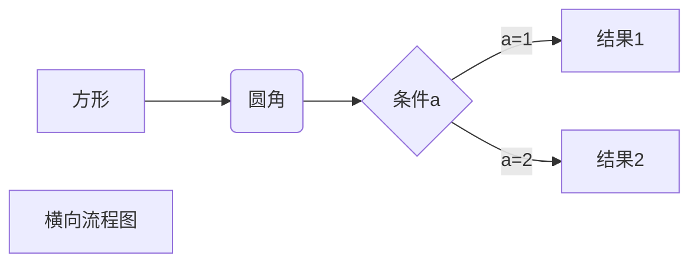
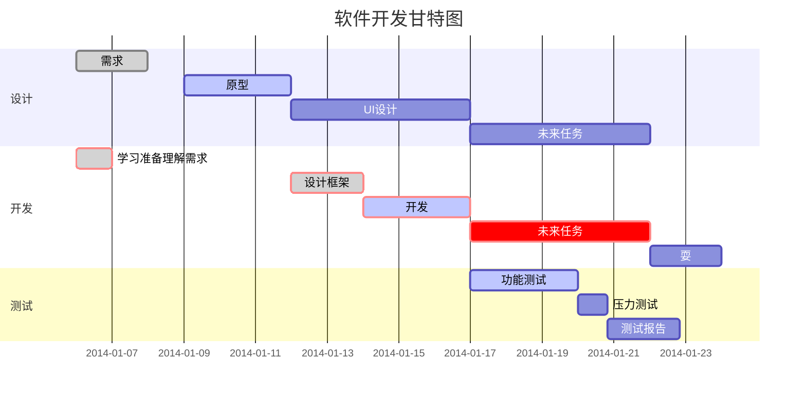

## 锚点链接

- Markdown 原始写法 `[名称](#id)`
- HTML 语法 `<a href="#id">名称</a>`

[方式一](#jump)

<a href="#jump">方式二</a>


<span id="jump">跳转到的地方</span>

---

## 折叠

```html
<details>
<summary>展开</summary>
	这是展开后的内容
</details>
```

<details>
<summary>展开</summary>
	这是展开后的内容
</details>

---

## 待办事项

```
-空格[空格]空格待完成

-空格[x]空格已完成

-空格[空格]空格~~未完成~~
```

- [x] 完成
- [ ] 未完成

---

## 键盘输入

```
<kbd>ctrl</kbd> + <kbd>s</kbd>
```

<kbd>ctrl</kbd> +  <kbd>s</kbd>

---

## 高亮显示

```
<mark>高亮</mark> 
```

<mark>高亮</mark> 

---

## Emoji 表情的插入

- GitHub 支持的 Emoji 表情插入:
  [GitHub 链接](https://gist.github.com/rxaviers/7360908)

- Emoji Unicode Tables:

  [Emoji Unicode characters for use on the web (timwhitlock.info)](https://apps.timwhitlock.info/emoji/tables/unicode#block-4-enclosed-characters)

  示例: &#x1F602;

  使用方法: 

  ```
  &#x1F602;
  ```

- 最**简单粗暴**的方法:
  直接复制粘贴 Emoji 表情

---

## 公式

```
$内容$
$$空格
```

$$
f(x)=a+b
$$

---

## 流程图



```flow
st=>start: 开始框
op=>operation: 处理框
cond=>condition: 判断框(是或否?)
sub1=>subroutine: 子流程
io=>inputoutput: 输入输出框
e=>end: 结束框
st->op->cond
cond(yes)->io->e
cond(no)->sub1(right)->op
```

```sequence
对象A->对象B: 对象B你好吗?（请求）
Note right of 对象B: 对象B的描述
Note left of 对象A: 对象A的描述(提示)
对象B-->对象A: 我很好(响应)
对象A->对象B: 你真的好吗？
```

```sequence
Title: 标题：复杂使用
对象A->对象B: 对象B你好吗?（请求）
Note right of 对象B: 对象B的描述
Note left of 对象A: 对象A的描述(提示)
对象B-->对象A: 我很好(响应)
对象B->小三: 你好吗
小三-->>对象A: 对象B找我了
对象A->对象B: 你真的好吗？
Note over 小三,对象B: 我们是朋友
participant C
Note right of C: 没人陪我玩
```

