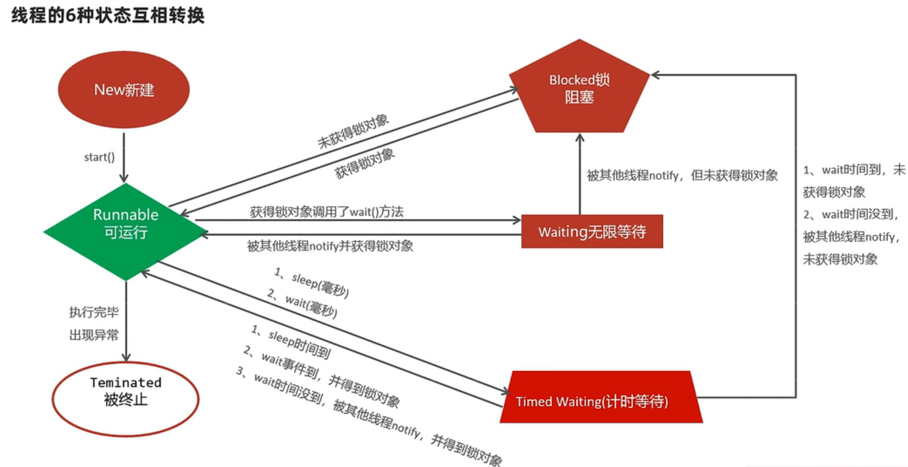
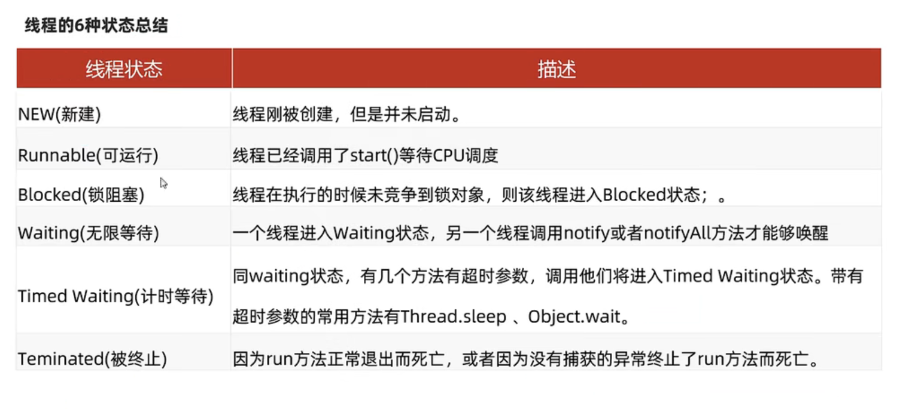

# Java基础

## Java基础

### 接口和抽象类的区别

* 抽象类可以存在普通成员函数，而接口中只能存在public abstract方法。 
* 抽象类中的成员变量可以是各种类型的，而接口中的成员变量只能是public static final类型的。 
* 抽象类只能继承一个，接口可以实现多个。

接口的设计目的，是对类的行为进行约束（更准确的说是一种“有”约束，因为接口不能规定类不可以有什么行为），也就是提供一种机制，可以强制要求不同的类具有相同的行为。它只约束了行为的有无， 但不对如何实现行为进行限制。 

而抽象类的设计目的，是代码复用。当不同的类具有某些相同的行为(记为行为集合A)，且其中一部分行为的实现方式一致时（A的非真子集，记为B），可以让这些类都派生于一个抽象类。在这个抽象类中实现了B，避免让所有的子类来实现B，这就达到了代码复用的目的。而A减B的部分，留给各个子类自己 实现。正是因为A-B在这里没有实现，所以抽象类不允许实例化出来（否则当调用到A-B时，无法执行）。 

抽象类是对类本质的抽象，表达的是 is a 的关系，比如： BMW is a Car 。抽象类包含并实现子类的通用特性，将子类存在差异化的特性进行抽象，交由子类去实现。 

而接口是对行为的抽象，表达的是 like a 的关系。比如： Bird like a Aircraft （像飞行器一样可以 飞），但其本质上 is a Bird 。接口的核心是定义行为，即实现类可以做什么，至于实现类主体是谁、 是如何实现的，接口并不关心。 

使用场景：当你关注一个事物的本质的时候，用抽象类；当你关注一个操作的时候，用接口。 

抽象类的功能要远超过接口，但是，定义抽象类的代价高。因为高级语言来说（从实际设计上来说也是）每个类只能继承一个类。在这个类中，你必须继承或编写出其所有子类的所有共性。虽然接口在功能上会弱化许多，但是它只是针对一个动作的描述。而且你可以在一个类中同时实现多个接口。在设计阶段会降低难度。


## 集合

### List和Set的区别

**List：**有序，按对象进入的顺序保存对象，可重复，允许多个Null元素对象，可以使用Iterator取出 所有元素，在逐一遍历，还可以使用get(int index)获取指定下标的元素

**Set：**无序，不可重复，最多允许有一个Null元素对象，取元素时只能用Iterator接口取得所有元 素，在逐一遍历各个元素

### ArrayList和LinkedList区别

ArrayList：基于动态数组，连续内存存储，适合下标访问（随机访问），扩容机制：因为数组长度固定，超出长度存数据时需要新建数组，然后将老数组的数据拷贝到新数组，如果不是尾部插入数据还会涉及到元素的移动（往后复制一份，插入新元素），使用尾插法并指定初始容量可以极大提升性能、甚至超过linkedList（需要创建大量的node对象）

LinkedList：基于链表，可以存储在分散的内存中，适合做数据插入及删除操作，不适合查询：需要逐 一遍历。

遍历LinkedList必须使用iterator不能使用for循环，因为每次for循环体内通过get(i)取得某一元素时都需 要对list重新进行遍历，性能消耗极大。 另外不要试图使用indexOf等返回元素索引，并利用其进行遍历，使用indexlOf对list进行了遍历，当结果为空时会遍历整个列表。

## 线程

### 线程生命周期

* 线程的状态

  线程的状态:也就是线程从生到死的过程，以及中间经历的各种状态及状态转换。

  理解线程的状态有利于提升并发编程的理解能力。

* Java线程的状态

  Java总共定义了6种状态

  6种状态都定义在Thread类的内部枚举类中。

```java
public class Thread {
    ...
    public enum State {
        NEW,  // 新建
        RUNNABLE, // 可运行
        BLOCKED, // 阻塞
        WAITING, // 无限等待
        TIMED_WAITING, // 计时等待
        TERMINATER; // 终止
    }
    ...
}
```





### 线程池

#### 临时线程什么时候创建

新任务提交时发现核心线程都在忙，任务队列也满了，并且还可以创建临时线程，此时才会创建临时线程。

#### 什么时候会开始拒绝任务

核心线程和临时线程都在忙，任务队列也满了，新的任务过来的时候才会开始任务拒绝

## 其他

### 并发和并行

* 并发与并行

​	正在运行的程序（软件）就是一个独立的进程，线程是属于进程的，多个线程其实是并发与并行同时进行的。

* 并发的理解:

  * CPU同时处理线程的数量有限。

  * CPU会轮询为系统的每个线程服务，由于CPU切换的速度很快，给我们的感觉这些线程在同时执行，这就是并发。

* 并行的理解:
  * 在同一个时刻上，同时有多个线程在被CPU处理并执行。

* 简单说说并发和并行的含义：
  * 并发:CPU分时轮询的执行线程。
  * 并行:同一个时刻同时在执行。

# Spring

### 解释下Spring支持的几种bean的作用域。

* **singleton：**默认，每个容器中只有一个bean的实例，单例的模式由BeanFactory自身来维护。该对象的生命周期是与Spring IOC容器一致的（但在第一次被注入时才会创建）。
* **prototype：**为每一个bean请求提供一个实例。在每次注入时都会创建一个新的对象
* **request：**bean被定义为在每个HTTP请求中创建一个单例对象，也就是说在单个请求中都会复用 这一个单例对象。
* **session：**与request范围类似，确保每个session中有一个bean的实例，在session过期后，bean 会随之失效。
* **application：**bean被定义为在ServletContext的生命周期中复用一个单例对象。 
* **websocket：**bean被定义为在websocket的生命周期中复用一个单例对象。 
* **global-session：**全局作用域，global-session和Portlet应用相关。当你的应用部署在Portlet容器 中工作时，它包含很多portlet。如果你想要声明让所有的portlet共用全局的存储变量的话，那么 这全局变量需要存储在global-session中。全局作用域与Servlet中的session作用域效果相同。

### Spring框架中的单例Bean是线程安全的么？

Spring中的Bean默认是单例模式的，框架并没有对bean进行多线程的封装处理。

如果Bean是有状态的 那就需要开发人员自己来进行线程安全的保证，最简单的办法就是改变bean的作用域把 `singleton`改为`protopyte`这样每次请求Bean就相当于是 new Bean() 这样就可以保证线程的安全了。

* 有状态就是有数据存储功能
* 无状态就是不会保存数据 controller、service和dao层本身并不是线程安全的，只是如果只是调用里面的方法，而且多线程调用一个实例的方法，会在内存中复制变量，这是自己的线程的工作内存，是安全的。

Dao会操作数据库Connection，Connection是带有状态的，比如说数据库事务，Spring的事务管理器使用Threadlocal为不同线程维护了一套独立的connection副本，保证线程之间不会互相影响（Spring 是如何保证事务获取同一个Connection的）

不要在bean中声明任何有状态的实例变量或类变量，如果必须如此，那么就使用ThreadLocal把变量变为线程私有的，如果bean的实例变量或类变量需要在多个线程之间共享，那么就只能使用 synchronized、lock、CAS等这些实现线程同步的方法了。

## 设计模式

### Spring 框架中都用到了哪些设计模式？

**简单工厂：**由一个工厂类根据传入的参数，动态决定应该创建哪一个产品类。

> Spring中的BeanFactory就是简单工厂模式的体现，根据传入一个唯一的标识来获得Bean对象，但是否是在传入参数后创建还是传入参数前创建这个要根据具体情况来定。

**工厂方法：**

> 实现了FactoryBean接口的bean是一类叫做factory的bean。其特点是，spring会在使用getBean()调用获得该bean时，会自动调用该bean的getObject()方法，所以返回的不是factory这个bean，而是这个 bean.getOjbect()方法的返回值。

**单例模式：**保证一个类仅有一个实例，并提供一个访问它的全局访问点

> spring对单例的实现： spring中的单例模式完成了后半句话，即提供了全局的访问点BeanFactory。但没有从构造器级别去控制单例，这是因为spring管理的是任意的java对象。

**适配器模式：**

> Spring定义了一个适配接口，使得每一种Controller有一种对应的适配器实现类，让适配器代替controller执行相应的方法。这样在扩展Controller时，只需要增加一个适配器类就完成了SpringMVC 的扩展了。

**装饰器模式：**动态地给一个对象添加一些额外的职责。就增加功能来说，Decorator模式相比生成子类 更为灵活。

> Spring中用到的包装器模式在类名上有两种表现：一种是类名中含有Wrapper，另一种是类名中含有 Decorator。

**动态代理：**

> 切面在应用运行的时刻被织入。一般情况下，在织入切面时，AOP容器会为目标对象创建动态的创建一个代理 对象。SpringAOP就是以这种方式织入切面的。 织入：把切面应用到目标对象并创建新的代理对象的过程。

**观察者模式：**

> spring的事件驱动模型使用的是 观察者模式 ，Spring中Observer模式常用的地方是listener的实现。

**策略模式：**

> Spring框架的资源访问Resource接口。该接口提供了更强的资源访问能力，Spring 框架本身大量使用了 Resource 接口来访问底层资源。

**模板方法：**父类定义了骨架（调用哪些方法及顺序），某些特定方法由子类实现。 

最大的好处：代码复用，减少重复代码。除了子类要实现的特定方法，其他方法及方法调用顺序都在父类中预先写好了。

## Spring事务

### Spring事务的实现方式和原理以及隔离级别？

在使用Spring框架时，可以有两种使用事务的方式，一种是编程式的，一种是申明式的， @Transactional注解就是申明式的。

首先，事务这个概念是数据库层面的，Spring只是基于数据库中的事务进行了扩展，以及提供了一些能让程序员更加方便操作事务的方式。

比如我们可以通过在某个方法上增加@Transactional注解，就可以开启事务，这个方法中所有的sql都会在一个事务中执行，统一成功或失败。

在一个方法上加了@Transactional注解后，Spring会基于这个类生成一个代理对象，会将这个代理对象作为bean，当在使用这个代理对象的方法时，如果这个方法上存在@Transactional注解，那么代理逻辑会先把事务的自动提交设置为false，然后再去执行原本的业务逻辑方法，如果执行业务逻辑方法没有出现异常，那么代理逻辑中就会将事务进行提交，如果执行业务逻辑方法出现了异常，那么则会将事务进行回滚。

当然，针对哪些异常回滚事务是可以配置的，可以利用@Transactional注解中的rollbackFor属性进行配置，默认情况下会对RuntimeException和Error进行回滚。

spring事务隔离级别就是数据库的隔离级别：外加一个默认级别

* read uncommitted（未提交读）
* read committed（提交读、不可重复读）
* repeatable read（可重复读）
* serializable（可串行化）

> 数据库的配置隔离级别是Read Commited，而Spring配置的隔离级别是Repeatable Read，请问这时隔离级别是以哪一个为准？ 以Spring配置的为准，如果spring设置的隔离级别数据库不支持，效果取决于数据库。

### spring事务传播机制

多个事务方法相互调用时,事务如何在这些方法间传播

> 方法A是一个事务的方法，方法A执行过程中调用了方法B，那么方法B有无事务以及方法B对事务的要求不同都会对方法A的事务具体执行造成影响，同时方法A的事务对方法B的事务执行也有影响，这种影响具体是什么就由两个方法所定义的事务传播类型所决定。

**REQUIRED(Spring默认的事务传播类型)：**如果当前没有事务，则自己新建一个事务，如果当前存在事务，则加入这个事务。

**SUPPORTS：**当前存在事务，则加入当前事务，如果当前没有事务，就以非事务方法执行。

**MANDATORY：**当前存在事务，则加入当前事务，如果当前事务不存在，则抛出异常。

**REQUIRES_NEW：**创建一个新事务，如果存在当前事务，则挂起该事务。

**NOT_SUPPORTED：**以非事务方式执行，如果当前存在事务，则挂起当前事务。

**NEVER：**不使用事务，如果当前事务存在，则抛出异常。

**NESTED：**如果当前事务存在，则在嵌套事务中执行，否则REQUIRED的操作一样（开启一个事务）

> 和REQUIRES_NEW的区别
>
> REQUIRES_NEW是新建一个事务并且新开启的这个事务与原有事务无关，而NESTED则是当前存在事务时（我 们把当前事务称之为父事务）会开启一个嵌套事务（称之为一个子事务）。 在NESTED情况下父事务回滚时， 子事务也会回滚，而在REQUIRES_NEW情况下，原有事务回滚，不会影响新开启的事务。
>
> 和REQUIRED的区别
>
> REQUIRED情况下，调用方存在事务时，则被调用方和调用方使用同一事务，那么被调用方出现异常时，由于 共用一个事务，所以无论调用方是否catch其异常，事务都会回滚 而在NESTED情况下，被调用方发生异常 时，调用方可以catch其异常，这样只有子事务回滚，父事务不受影响
