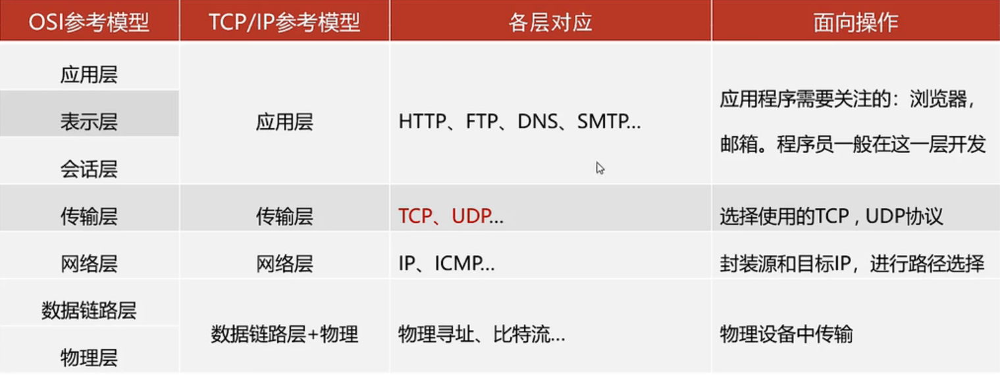
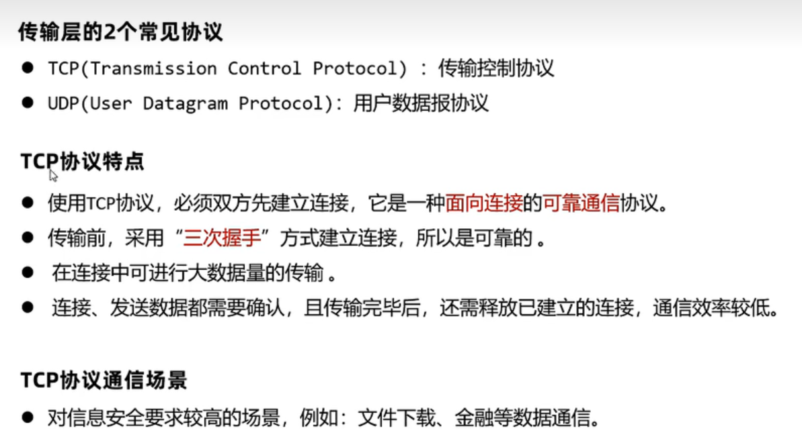
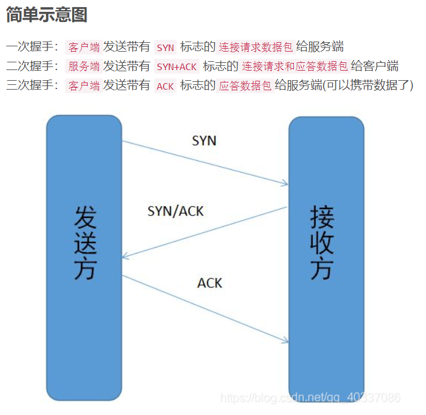
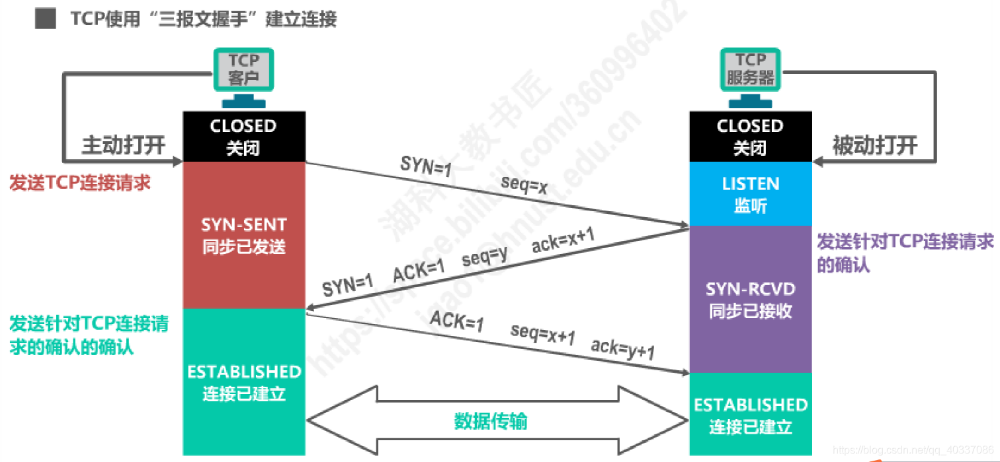
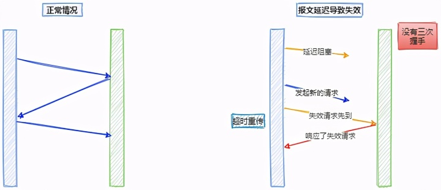
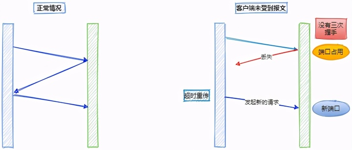
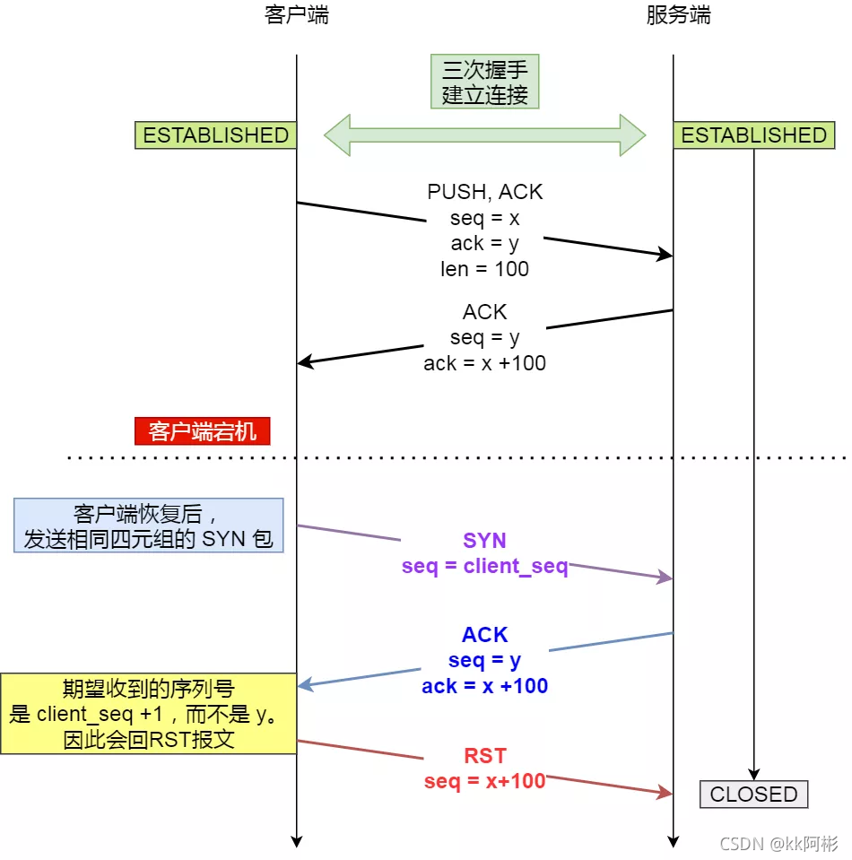
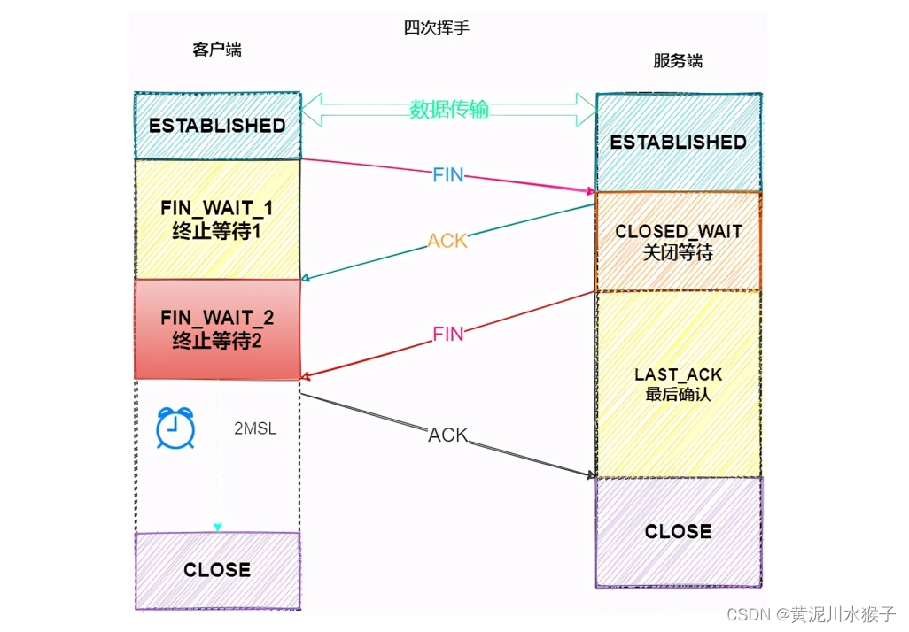
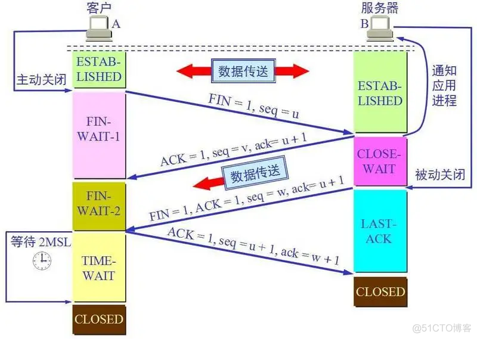

## TCP协议

### TCP三次握手

#### 简单示意图

#### 详细描述

**0、初始状态：**
服务端监听某个端口，处于 `LISTEN` 状态。

**1、客户端发送TCP连接请求**
客户端会**随机**一个`初始序列号seq=x`（client_isn），
设置SYN=1 ，表示这是SYN握手报文。然后就可以把这个 SYN 报文发送给服务端了，表示向服务端发起连接，之后客户端处于 `同步已发送` 状态。

**2、服务端发送针对TCP连接请求的确认**
服务端收到客户端的 SYN 报文后，也**随机**一个初始序列号（`server_isn`）(seq=y)
设置ack=x+1, 表示收到了客户端的x之前的数据，希望客户端下次发送的数据从x+1开始。
设置 SYN=1 和 ACK=1。表示这是一个SYN握手和ACK确认应答报文。
最后把该报文发给客户端，该报文也不包含应用层数据，之后服务端处于 `同步已接收` 状态。

**3、客户端发送确认的确认**
客户端收到服务端报文后，还要向服务端回应最后一个`应答报文`，
将ACK置为 1 ，表示这是一个应答报文
ack=y+1 ，表示收到了服务器的y之前的数据，希望服务器下次发送的数据从y+1开始。
最后把报文发送给服务端，**这次报文可以携带数据**，之后客户端处于 `连接已建立` 状态。
服务器收到客户端的应答报文后，也进入`连接已建立` 状态

#### 为什么要三次握手，而不是两次？

原因主要有两个：
**1、主要原因是为了防止历史连接**

三次握手时，在网络拥堵等情况下，第一次握手的SYN包迟迟没能发送到服务端，那么客户端会连续发送多次 SYN 建立连接的报文，那么就可能出现一个「旧 SYN 报文」比「最新的 SYN 」 报文早到达了服务端；

那么此时服务端就会回一个 SYN + ACK 报文给客户端；

- 如果是两次握手连接，就不能判断当前连接是否是历史连接，导致错误。
- 三次握手时，客户端收到后可以根据自身的上下文，判断这是一个历史连接（序列号过期或超时），那么客户端就会发送 RST 报文给服务端，中止这一次连接。

**2、三次握手可以避免资源浪费**

如果只有「两次握手」，当客户端的 SYN 请求连接在网络中阻塞，客户端没有接收到 ACK 报文，就会重新发送 SYN ，

- 如果是三次握手，第三次握手时服务器可以得到客户端的ack，知道连接已成功建立。
- 如果没有第三次握手，服务器不清楚客户端是否收到了自己发送的建立连接的 ACK 确认信号，所以每收到一个 SYN 就只能先主动建立一个连接，如果客户端的 SYN 阻塞了，重复发送多次 SYN 报文，那么服务器在收到请求后就会建立多个冗余的无效链接，造成不必要的资源浪费。

#### 数据包丢失了该怎么办？

**1、TCP 第一次握手的 SYN 丢包了，会发生什么？**
`重传` SYN 数据包，重传次数超过阈值后放弃

**2、TCP 第二次握手的 SYN、ACK 丢包了，会发生什么？**
客户端 SYN 包没有收到ACK，所以会超时重传
服务端 SYN包也没有收到ACK， 也会超时重传。

**3、TCP 第三次握手的 ACK 包丢了，会发生什么？**
服务端会一直`重传` SYN、ACK 包，重传次数超过阈值后放弃
而`客户端`根据是否开启保活机制分为两种情况：

- 开启了保活机制的话，会经过 `2 小时 11 分 15 秒`发现一个「死亡」连接，于是客户端就会断开连接。
- 没有开启的话，则会一直重传该数据包，直到重传次数超过阈值后就会断开 TCP 连接。

#### 初始序列号为什么随机产生？

为了**网络安全**
如果不是随机产生初始序列号，黑客将会以很容易的方式获取到你与其他主机之间通信的`初始化序列号`，并且伪造序列号进行攻击，这已经成为一种很常见的网络攻击手段。

#### 为什么 SYN 段不携带数据却要消耗一个序列号呢？

因为SYN 段需要对方的确认，所以需要占用一个序列号确保这个确认不会出现歧义。如果不占序列号的话，怎么知道这个确认是对数据包的确认还是对syn报文的确认呢？

#### *每次握手可以确定哪些东西？

第一次握手：Client 什么都不能确认；Server 确认了**对方发送正常，自己接收正常**

第二次握手：Client 确认了**自己发送、接收正常，对方发送、接收正常；**

第三次握手：Server 确认了**自己发送正常，对方接收正常**

#### 三次握手过程中可以携带数据吗

很多人可能会认为三次握手都不能携带数据，其实第三次握手的时候，是可以携带数据的。也就是说，第一次、第二次握手不可以携带数据，而第三次握手是可以携带数据的。

为什么这样呢？大家可以想一个问题，假如第一次握手可以携带数据的话，如果有人要恶意攻击服务器，那他每次都在第一次握手中的 SYN 报文中放入大量的数据，因为攻击者根本就不理服务器的接收、发送能力是否正常，然后疯狂着重复发 SYN 报文的话，这会让服务器花费很多时间、内存空间来接收这些报文。也就是说，第一次握手可以放数据的话，其中一个简单的原因就是会让服务器更加容易受到攻击了。
而对于第三次的话，此时客户端已经处于 established 状态，也就是说，对于客户端来说，他已经建立起连接了，并且也已经知道服务器的接收、发送能力是正常的了，所以能携带数据页没啥毛病。

#### 一个已经建立的 TCP 连接中，客户端中途宕机了，客户端恢复后，向服务端发送SYN包重新建立连接，此时服务端会怎么处理？

我们知道TCP 连接是由「四元组」唯一确认的。
然后这个场景中，客户端的IP、服务端IP、目的端口并没有变化
所以这个问题关键在于：**本次连接的源端口是否和上一次连接的源端口相同。**
所以分两种情况：

1、不相同
此时服务端会认为是新的连接要建立，于是就会通过三次握手来建立新的连接。

> 那旧连接里的服务端会怎么样呢？
> 如果服务端发送了数据包给客户端，由于客户端的连接已经被关闭了，此时客户的内核就会回 `RST` 报文，服务端收到后就会释放连接。
> 如果服务端一直没有发送数据包给客户端，在超过一段时间后， TCP `保活机制`就会启动，检测到客户端没有存活后，接着服务端就会释放掉该连接。

2、相同

处于 establish 状态的服务端会回复一个携带了对上次报文的确认号和序列号，这个 ACK 被称之为 Challenge ACK。
接着，客户端收到这个 Challenge ACK，发现序列号并不是自己期望收到的，于是就会回 `RST` 报文，服务端收到后，就会释放掉该连接。

#### 如何手动关闭一个TCP连接

**结论：**伪造一个能关闭 TCP 连接的 RST 报文
这个合法的 RST 报文必须同时满足`「四元组相同」和「序列号正好落在对方的滑动窗口内」`这两个条件。
**怎么伪造？**
直接伪造符合预期的序列号是比较困难，因为如果一个正在传输数据的 TCP 连接，滑动窗口时刻都在变化，因此很难伪造一个刚好落在对方滑动窗口内的序列号的 RST 报文。
办法还是有的，我们可以伪造一个四元组相同的 `SYN` 报文，来拿到“合法”的序列号！
**怎么拿到？**
如果处于 establish 状态的服务端，收到四元组相同的 SYN 报文后，会回复一个 Challenge ACK，这个 ACK 报文里的「确认号」，正好是服务端下一次想要接收的序列号，说白了，就是可以通过这一步拿到服务端下一次预期接收的序列号。
然后用这个确认号作为 RST 报文的序列号，发送给服务端，此时服务端会认为这个 RST 报文里的序列号是合法的，于是就会释放连接！

### TCP四次挥手

#### 四次挥手详解

上图是客户端主动关闭连接 ：

**一次挥手**

- 客户端打算关闭连接，此时会发送一个 TCP 首部 FIN 标志位被置为 1 的报文，也即 FIN 报文，之后客户端进入 FIN_WAIT_1 状态。

**二次挥手**

- 服务端收到该报文后，就向客户端发送 ACK 应答报文，接着服务端进入 CLOSED_WAIT 状态。

**三次挥手**

- 客户端收到服务端的 ACK 应答报文后，之后进入 FIN_WAIT_2 状态。等待服务端处理完数据后，也向客户端发送 FIN 报文，之后服务端进入 LAST_ACK 状态。

**四次挥手**

- 客户端收到服务端的 FIN 报文后，回一个 ACK 应答报文，之后进入 TIME_WAIT 状态
- 服务器收到了 ACK 应答报文后，就进入了 CLOSED 状态，至此服务端已经完成连接的关闭。
- 客户端在经过 2MSL 一段时间后，自动进入 CLOSED 状态，至此客户端也完成连接的关闭。

你可以看到，每个方向都需要一个 FIN 和一个 ACK，因此通常被称为四次挥手

**1）**. 客户端进程发出连接释放报文，并且停止发送数据。释放数据报文首部，FIN=1，其序列号为seq=u（等于前面已经传送过来的数据的最后一个字节的序号加1），此时，客户端进入FIN-WAIT-1（终止等待1）状态。 TCP规定，FIN报文段即使不携带数据，也要消耗一个序号。
**2）**. 服务器收到连接释放报文，发出确认报文，ACK=1，ack=u+1，并且带上自己的序列号seq=v，此时，服务端就进入了CLOSE-WAIT（关闭等待）状态。TCP服务器通知高层的应用进程，客户端向服务器的方向就释放了，这时候处于半关闭状态，即客户端已经没有数据要发送了，但是服务器若发送数据，客户端依然要接受。这个状态还要持续一段时间，也就是整个CLOSE-WAIT状态持续的时间。
**3）**. 客户端收到服务器的确认请求后，此时，客户端就进入FIN-WAIT-2（终止等待2）状态，等待服务器发送连接释放报文（在这之前还需要接受服务器发送的最后的数据）。
**4）**. 服务器将最后的数据发送完毕后，就向客户端发送连接释放报文，FIN=1，ack=u+1，由于在半关闭状态，服务器很可能又发送了一些数据，假定此时的序列号为seq=w，此时，服务器就进入了LAST-ACK（最后确认）状态，等待客户端的确认。
**5）**. 客户端收到服务器的连接释放报文后，必须发出确认，ACK=1，ack=w+1，而自己的序列号是seq=u+1，此时，客户端就进入了TIME-WAIT（时间等待）状态。注意此时TCP连接还没有释放，必须经过2∗∗MSL（最长报文段寿命）的时间后，当客户端撤销相应的TCB后，才进入CLOSED状态。
**6）**. 服务器只要收到了客户端发出的确认，立即进入CLOSED状态。同样，撤销TCB后，就结束了这次的TCP连接。可以看到，服务器结束TCP连接的时间要比客户端早一些。

#### 为什么需要四次挥手

其实是客户端和服务端的两次挥手，也就是客户端和服务端分别释放连接的过程.
再来回顾下四次挥手双方发 FIN 包的过程，就能理解为什么需要四次了。

- 关闭连接时，客户端向服务端发送 FIN 时，仅仅表示客户端不再发送数据了但是还能接收数据。
- 服务器收到客户端的 FIN 报文时，先回一个 ACK 应答报文，而服务端可能还有数据需要处理和发送，等服务端不再发送数据时，才发送 FIN 报文给客户端来表示同意现在关闭连接。

#### 为什么TCP连接的时候是3次，关闭的时候却是4次？

因为只有在客户端和服务端都没有数据要发送的时候才能断开TCP。而客户端发出FIN报文时只能保证客户端没有数据发了，服务端还有没有数据发客户端是不知道的。而服务端收到客户端的FIN报文后只能先回复客户端一个确认报文来告诉客户端我服务端已经收到你的FIN报文了，但我服务端还有一些数据没发完，等这些数据发完了服务端才能给客户端发FIN报文(所以不能一次性将确认报文和FIN报文发给客户端，就是这里多出来了一次)。

#### 为什么客户端在TIME-WAIT阶段要等2MSL？

为的是确认服务器端是否收到客户端发出的 ACK 确认报文，当客户端发出最后的 ACK 确认报文时，并不能确定服务器端能够收到该段报文。

所以客户端在发送完 ACK 确认报文之后，会设置一个时长为 2MSL 的计时器。

MSL 指的是 Maximum Segment Lifetime：一段 TCP 报文在传输过程中的最大生命周期。

2MSL 即是服务器端发出为 FIN 报文和客户端发出的 ACK 确认报文所能保持有效的最大时长。

服务器端在 1MSL 内没有收到客户端发出的 ACK 确认报文，就会再次向客户端发出 FIN 报文：

- 如果客户端在 2MSL 内，再次收到了来自服务器端的 FIN 报文，说明服务器端由于各种原因没有接收到客户端发出的 ACK 确认报文。客户端再次向服务器端发出 ACK 确认报文，计时器重置，重新开始 2MSL 的计时。
- 否则客户端在 2MSL 内没有再次收到来自服务器端的 FIN 报文，说明服务器端正常接收了 ACK 确认报文，客户端可以进入 CLOSED 阶段，完成“四次挥手”。

所以，客户端要经历时长为 2SML 的 TIME-WAIT 阶段;这也是为什么客户端比服务器端晚进入 CLOSED 阶段的原因。

> 这里特别需要主要的就是TIME_WAIT这个状态了，这个是面试的高频考点，就是要理解，为什么客户端发送 ACK 之后不直接关闭，而是要等一阵子才关闭。这其中的原因就是，要确保服务器是否已经收到了我们的 ACK 报文，如果没有收到的话，服务器会重新发 FIN 报文给客户端，客户端再次收到 ACK 报文之后，就知道之前的 ACK 报文丢失了，然后再次发送 ACK 报文。
> 至于 TIME_WAIT 持续的时间至少是一个报文的来回时间。一般会设置一个计时，如果过了这个计时没有再次收到 FIN 报文，则代表对方成功就是 ACK 报文，此时处于 CLOSED 状态。

## UDP协议